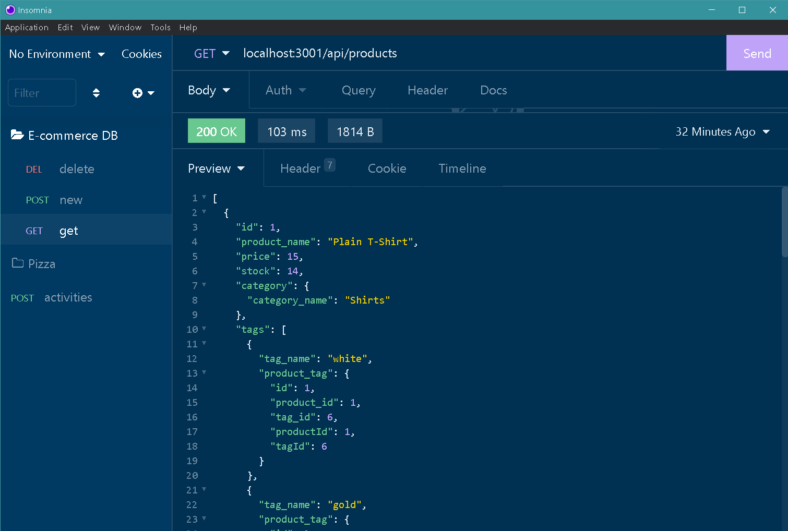

# E-commerce Back End

<br />

 <br />

## Table of Contents 

- [Description](#description)
- [Installation](#installation)
- [Screenshots](#screenshots)
- [Demos](#demos)
- [Deployed](#deployedapplicationlink)
- [Languages](#languages)
- [License](#license)
- [Questions](#questions)

<br />
<br />

## Description

Due to the prevalence of Internet retail, also known as e-commerce, is the largest sector of the electronics industry, having generated an estimated US$29 trillion in 2017 (Source: United Nations Conference on Trade and Development). This application is the back end for an e-commerce site using Express.js API and configured to use Sequelize to interact with a MySQL database.<br />

## Installation
To install all the dependencies, use the command below:
```
git clone git@github.com:Tonycodesnow/E-Commerce-Back-End.git
```
Then, inside the folder, run the following command:
```
npm init
```
Then, install the dependencies with command:
```
npm i
```
Then, run the folloeing command to run the seed file:
```
npm run seed
```
When you're ready to run the application, from the root folder, type the below into your command line to start the server:
```
npm start
```
Once the E-commerce application runs, the user can utilize the functionality of the crud methods of GET, POST, PUT, and DELETING data while being tested in Insomnia <br />

## Screenshots

screenshot in insomia

<p align="center"></p> <br />
## Demos

Click on the link below for a video demonstration of the application and the generated API routes:

https://www.youtube.com/watch?v=2_dT2A-LKOg


## Github application link

https://github.com/Tonycodesnow/E-Commerce-Back-End  <br />

## Languages

JavaScript, Node, Inquirer, MySQL2, Sequelize, Express.js API and the dotenv package. <br />


## License

This project is licensed under the MIT license. <br />
  
<br />

## Questions?

If you have any questions, contact me at: 
tony.huertinez@gmail.com  <br />
Check out my other work at GitHUb:
[antoniohuerta](https://github.com/Tonycodesnow) <br />